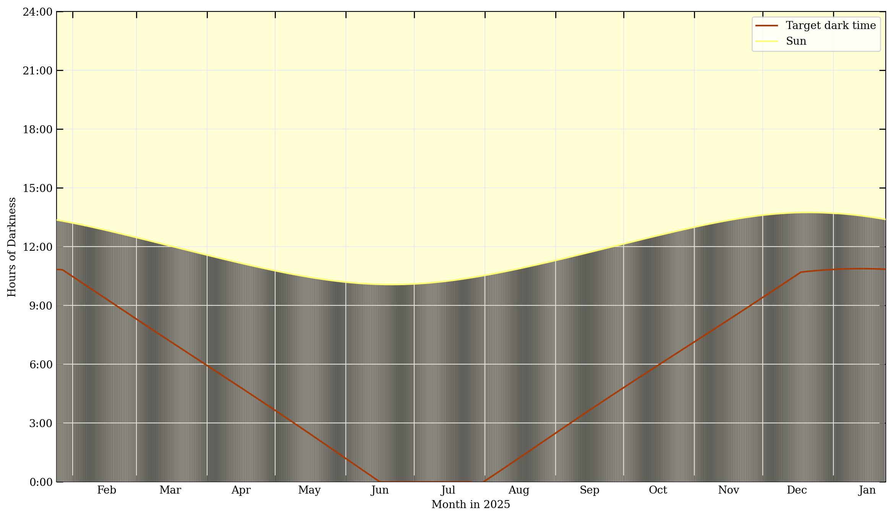
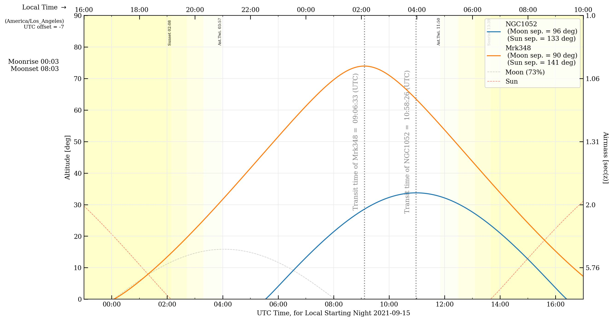

Classic observation planning plots
==================================

Prepare classic target elevation track plots and finder plots to aid
your observations.

In this example, we will plan a set of observations of the Crab Nebula
from the William Herschel Telescope on lovely La Palma. Be sure to enjoy
some arepas and barraquitos while you're there.

This tutorial will also use some other galaxies for targets, and VLBA
stations for additional examples.

Making the observation preparation plots
~~~~~~~~~~~~~~~~~~~~~~~~~~~~~~~~~~~~~~~~

.. code:: python

    import numpy as np
    import ephem
    import datetime as dt
    from astropy.time import Time
    import pytz
    import matplotlib.pyplot as plt

    import obsplanning as obs

    wht = obs.create_ephem_observer('WHT', '-17 52 53.8', '28 45 37.7', 2344)
    crab = obs.create_ephem_target('Crab Nebula','05:34:31.94','22:00:52.2') 

    # Observation start/end times:  5 PM to 9 AM local time
    sunset, twi_civil, twi_naut, twi_astro = obs.calculate_twilight_times(wht, 
        '2025/01/01 23:59:00')
    obsstart_local_dt = obs.dt_naive_to_dt_aware( 
        ephem.Date('2025/10/31 17:00:00').datetime(), 'Atlantic/Canary' ) 
    obsend_local_dt = obs.dt_naive_to_dt_aware( 
        ephem.Date('2025/11/01 09:00:00').datetime(), 'Atlantic/Canary' ) 
    obsstart = obs.dtaware_to_ephem(obsstart_local_dt)
    obsend   = obs.dtaware_to_ephem(obsend_local_dt)

    # A couple more example targets
    ngc1052=obs.create_ephem_target('NGC1052','02:41:04.7985','-08:15:20.751') 
    ngc3147=obs.create_ephem_target('NGC3147','10:16:53.65','73:24:02.7') 

Note that for subsequent calculations and plots that use local time,
things will run faster if you specify the Observer's timezone beforehand
(when you create it). If you don't have the timezone name string
already, it can be determined automatically.

.. code:: python

    # If the timezone name is known already:
    wht = obs.create_ephem_observer('WHT', '-17 52 53.8', '28 45 37.7', 2344, 
        timezone='Atlantic/Canary')

    # To automatically determine the timezone: 
    wht = obs.create_ephem_observer('WHT', '-17 52 53.8', '28 45 37.7', 2344, timezone='auto')

    print(wht.timezone)
    # --> 'Atlantic/Canary'

Calculate the daily transit times, rise times, set times, and peak
altitudes for the specified year. This function is one of several that
can automatically determine the timezone from the observer object (using
tzwhere).

.. code:: python

    TRSP = obs.compute_yearly_target_data(crab, wht, '2025', timezone='auto', time_of_obs='night',
            peak_alt=True, local=True)
    # --> Four arrays: Transit,Rise,Set,PeakAltitude for each of the 365 days in the year

Calculate the previous set+rise times and next set+rise times for
NGC1052, as seen from the St Croix VLBA station

.. code:: python

    prev_setrise,next_setrise = obs.calculate_antenna_visibility_limits(ngc1052, obs.vlbaSC, 
            ephem.Date('2025/01/01 20:36:31'), elevation_limit_deg=15.)

Now plot the Rise/Set/Transit times over the course of the calendar
year. This is a somewhat busy plot, but compactly visualizes how the
daily rise, set, and transit times vary over the course of the year.
Daytime is also denoted by light yellow shading.

.. code:: python

    obs.plot_year_RST(crab, wht, '2025', showplot=True, savepath='./crab_2021RST.jpg')

The 1-hour discontinuities in March and October are due to the daylight
savings time switches.

|RST|

Calculate the optimal day/time to observe a specified target from a
specified observer site, for the given year. This is based on the
highest peak altitude.

.. code:: python

    obs.optimal_visibility_date(crab,wht,'2025',time_of_obs='night', verbose=True, local=True, 
        extra_info=False)
    # --> '2025/01/24 22:29:36'

    ### With verbose=True, info also printed to screen:
    # Optimal observing date for Crab Nebula, from WHT, in year 2025:
    #   2025/01/24  with transit occurring at 22:29:36 local time
    #   On that date, rise time = 15:36:35, set time = 05:22:38, peak altitude = 83.3 deg
    #   At transit, separation from Sun = 139 deg, Moon separation = 163 deg, Moon = 22% illuminated

This will run much faster if you supply the timezone (or it's already
set for the observer in 'auto' mode), rather than auto-calculating it
from the observer location. (In the case of wht above:
timezone='Atlantic/Canary') Users can specify the time of day to
consider for calculating the optimal date, using the time\_of\_obs
keyword - either with one of the accepted string descriptors
('midnight', 'noon', 'middark', 'peak'), or any specific time of the day
formatted as 'HH:MM:SS', for example '23:00:00' for 11 PM.

Plot the observability of the target over the course of the year, with
peak altitudes of the target and separations from the Sun & Moon
denoted. Next, plot the dark time over the course of a year, from the
specified observing site, and plot the target altitude track. These
plots are similar to the components of the classic 'starobs' plot.

.. code:: python

    obs.plot_year_observability(crab, wht, '2025', time_of_obs='22:00:00', 
        savepath='./crab_observability_2025.jpg') #Specifying calculations at 10PM

    obs.plot_year_darktime(crab, wht, '2025', savepath='./crab_darktime_2025.jpg')

|Crab Observability 2025|

|Darktime|

In the darktime plot, date is on the x-axis, and the number of hours of
nighttime is the value plotted on the y-axis. The yellow shading
represents daylight, and the dark shading in the lower part is
nighttime. The vertical bands of lightness during the nighttime
represent the brightness of the moon, from new (darker gray) to full
moon (lighter white).

--------------

Visibility tracks
~~~~~~~~~~~~~~~~~

Now, when a particular night has been selected for observations, it's
very useful to plot the target's altitude (or multiple targets'
altitudes), in order to time scans as close to transit as possible. This
following function plots visibility tracks of an astronomical target on
the sky, over the course of a night - like a classic 'staralt' plot.

.. code:: python

    obs.plot_night_observing_tracks(crab,wht,obsstart,obsend, simpletracks=False, 
        toptime='local', timezone='calculate', n_steps=1000, azcmap='rainbow', 
        savepath='crab_visibility_tracks.jpg')

|Visibility Plot A|

Besides the target elevation track and the transit time, useful
information such as moonrise/moonset and moon illumination is included,
and the Sun and Moon tracks are also shown for reference. The target's
angular sky separation from the Sun and Moon are given in the legend.
Night time is shaded as black (and the various grades of twilight in
lighter grays), with twilight and sunset/sunrise denoted by vertical
labels near the top of the plot. UTC time is shown on the bottom axis,
with the equivalent local time on the top. (In this example they are the
same, because the WHT has a UTC offset of 0 hours.)

In the plot above, the target's azimuth with respect to the observatory
is color coded by the cmap on the right, and this may help with
considerations of things such as cable wraps. However, it may be
preferable to use the simple\_tracks=True option to plot lines as simple
solid colors instead of the azimuth-colormapped track line, especially
if multiple target tracks are plotted.

.. code:: python

    obs.plot_night_observing_tracks([crab,ngc1052], wht, ephem.Date('2025/01/03 17:00:00'), 
        ephem.Date('2025/01/04 09:00:00'), simpletracks=True, toptime='local', 
        timezone='calculate', n_steps=1000, savepath='crab_visibility_tracks2.jpg')

|Visibility Plot B|

There is an option for a light-color background fill, which may be more
suitable for daytime or other observations that are not dark-limited.
The daytime is now represented by color shading and the nighttime has no
fill. Here is an example of observing a couple different targets from a
telescope observing during the daytime.

.. code:: python

    ngc1052=obs.create_ephem_target('NGC1052','02:41:04.7985','-08:15:20.751') 
    mrk348=obs.create_ephem_target('Mrk348','00:48:47.14','+31:57:25.1') 

    obsstart2=obs.dtaware_to_ephem( obs.construct_datetime('2021/09/15 16:00:00', 'dt', 
        timezone='US/Pacific')) 
    obsend2=obs.dtaware_to_ephem( obs.construct_datetime('2021/09/16 10:00:00', 'dt', 
        timezone='US/Pacific')) 

    obs.plot_night_observing_tracks([ngc1052,mrk348],obs.vlbaBR,obsstart2,obsend2, 
        plotmeantransit=False, simpletracks=True, toptime='local', timezone='US/Pacific', 
        n_steps=1000, azcmap='rainbow', light_fill=True, 
        savepath='Brewster_visibility_tracks.jpg', showplot=False)

|Visibility Plot C|

More examples of elevation track plots and calculations oriented towards
VLBI can be found in later sections.

To give more flexibility (for modifying the plot for your purposes,
annotating, etc), it's possible to plot the altitude tracks to a figure
axis. These visibility traacks could then be included in more complex
plots, with user-defined axes or sublots, etc.

.. code:: python

    fig1=plt.figure(1,figsize=(14,8)) 
    ax1=fig1.add_subplot(111) 
    obs.plot_visibility_tracks_toaxis([ngc1052,mrk348],obs.vlbaBR, 
        ephem.Date('2021/04/15 00:00:00'), ephem.Date('2021/04/15 23:59:59'), 
        ax1, timezone='US/Pacific') 
    plt.savefig('ngc1052_fullVLBA_april15.jpg'); plt.clf(); plt.close('all')

    # The above plotting and saving out can also be accomplished with this convenience function:

    obs.plot_visibility_tracks(target_list,observer,obsstart,obsend, weights=None, 
        duration_hours=0, plotmeantransit=False, timezone='calculate', 
        xaxisformatter=mdates.DateFormatter('%H:%M'), figsize=(14,8), dpi=200, 
        savepath='ngc1052_fullVLBA_april15.jpg',showplot=False)

|Visibility Plot to axes|

--------------

Finder plots
~~~~~~~~~~~~

To make a finder plot to help identify a starfield around a target, you
will need a background image. In particular, if you want to be able to
use WCS axes for coordinates, or to mark reference stars, .fits files
will be the best format. You can use your own .fits image, but
obsplanning includes a tool to automatically download cutout images in
.fits format from a variety of surveys. Specify either a set of target
coordinates or a common resolver name (e.g., 'M31'), and an image width,
and a survey name, and astroquery will retrieve your image. Here are
examples, using different methods of input:

.. code:: python

    #Download single cutout

    obs.download_cutout([83.63725, 22.0145], 10.,'Crab_2massJ_10arcmin.fits', 
        survey='2MASS-J', boxwidth_units='arcmin') #Crab Nebula, M1 

    bs.download_cutout(obs.sex2dec('05:34:32.94','22:00:52.2'), 10., 
        'Crab_2massJ_10arcmin.fits', survey='2MASS-J', boxwidth_units='arcmin') 

    obs.download_cutout('NGC1275', 90., './NGC1275_SDSSr_90asec.fits', survey='SDSSr', 
        search_name=True, boxwidth_units='asec')

There is also a function to download cutouts from several surveys at
once for a particular target:

.. code:: python

    obs.download_cutouts('M104',90.,'./M104_90asec', 
        surveybands=['DSS2 Blue','DSS2 Red','DSS2 IR'], 
        search_name=True, boxwidth_units='arcsec')

Some convenience functions for a few named surveys:

.. code:: python

    obs.download_sdss_cutouts('M104',90.,'./M104_90asec',search_name=True, 
        boxwidth_units='arcsec', SDSSbands=['SDSSg','SDSSi','SDSSr'])
    obs.download_dss_cutouts('M104', 90., './M104_90asec',search_name=True, 
        boxwidth_units='arcsec')
    obs.download_galex_cutouts('M104', 90., './M104_90asec',search_name=True, 
        boxwidth_units='arcsec')
    obs.download_wise_cutouts('M104', 90., './M104_90asec',search_name=True, 
        boxwidth_units='arcsec')
    obs.download_2mass_cutouts('M104', 90., './M104_90asec',search_name=True, 
        boxwidth_units='arcsec')
    obs.download_ukidss_cutouts('M104', 90., './M104_90asec',search_name=True, 
        boxwidth_units='arcsec')

Making the finder plots is easy with obsplanning. There are several
options, depending on how you would like to display the background sky
image: as a single image using a colormap, as an RGB image of 3 separate
frames, or as a multicolor image for an arbitrary number of individually
colorized image frames.

First, a single band background with colormap. Let's make a finder plot
for the Crab Nebula, and also mark a couple reference stars.

.. code:: python

    # For the reference stars, the input format will be [RA,DEC,label]
    refstars=[ ['5:34:42.3','22:10:34.5','HD 244988'], ['5:34:36.6','21:37:19.9','HD 36707'], ]

    # Now create the the finder plot with a single command:
    obs.make_finder_plot_singleband('Crab Nebula', 'M1', 50., boxwidth_units='arcmin', 
        survey='DSS2 Red', search_name=True, refregs=refstars, cmap='gist_yarg', dpi=200, 
        tickcolor='0.2', mfc='r', mec='w', bs_amin=10., )

|Classic finder plot|

Now use three different bands to create a simple RGB combination image
as the background. Aside from looking nicer, this can help bring out the
color in the field stars, etc.

.. code:: python

    refstars=[['5:34:42.3','22:10:34.5','HD 244988'], ['5:34:36.6','21:37:19.9','HD 36707'],]

    obs.make_finder_plot_simpleRGB('M1', obs.sex2dec('05:34:31.94','22:00:52.2'), 50., 
        'DSS2 IR','DSS2 Red','DSS2 Blue', boxwidth_units='arcmin', refregs=refstars, 
        Rscalefunc='linear', Gscalefunc='linear', Bscalefunc='linear', dpi=200, tickcolor='0.8',
        mfc='#C11B17',mec='w',bs_amin=10., filetype='jpg')

|Finder Plot RGB|

Now finally, you can use any number of different bands, and colorize
them to any desired color, to create a custom multicolor background
image. This may be particularly useful if you only have access to 2
images, in which case a simple RGB (missing one) would look off.

.. code:: python

    refstars=[['5:34:42.3','22:10:34.5','HD 244988'], ['5:34:36.6','21:37:19.9','HD 36707'],]

    obs.make_finder_plot_multicolor('M1', obs.sex2dec('05:34:31.94','22:00:52.2'), 50., 
        [['DSS2 Red','#A83C09'], ['DSS2 Blue','#336699']], boxwidth_units='arcmin', 
        refregs=refstars, scalefuncs=['linear','linear'], dpi=200, tickcolor='0.8', 
        mfc='#C11B17', mec='w',bs_amin=10., filetype='jpg')

|Finder Plot Multicolor|

.. |Visibility Plot B| image:: ../images/crab_visibility_tracks2.jpg
    :alt: Multiple target elevation tracks over the course of the night

.. |Finder Plot Multicolor| image:: ../images/M1_multicolor.jpg
    :alt: Crab Nebula finder plot with two individually colorized images making a multicolor composite for the background
