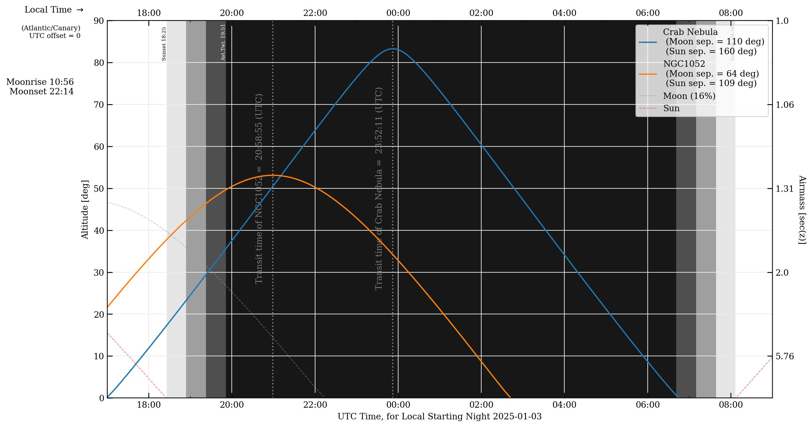
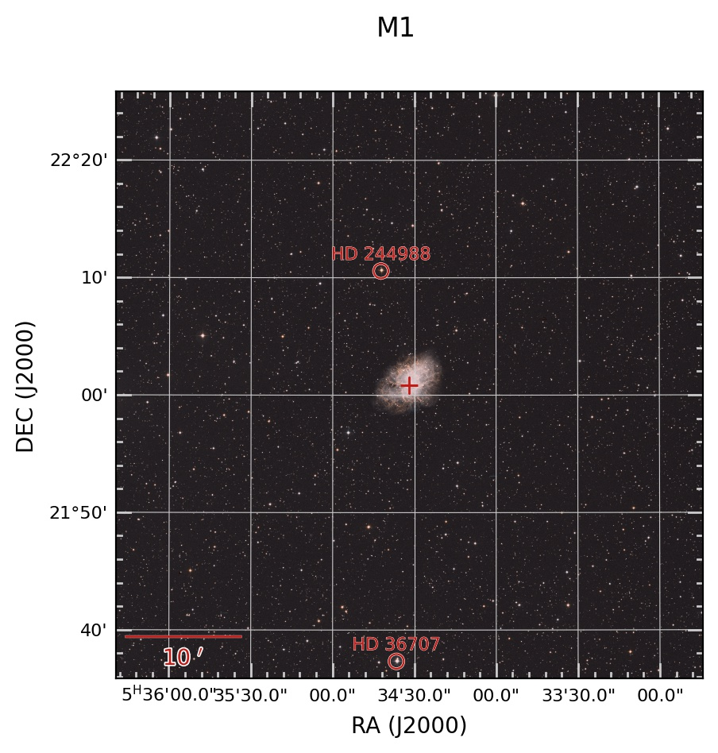

# Examples

Here are some tutorials on how to use obsplanning:

------------------

- [Overview](./examples/overview.md)

Overview of obsplanning and pyephem objects, and basic operations.

------------------

- [Visibility tracks and finder plots](./examples/classic_obsplots.md)

Making various plots to prepare for observations: finder plots, uptime, etc.

------------------

- [Determining observable targets from a source list](./examples/sourcelist_observability.md)

Using a source list, determine which targets are observable during a specified time window from a single telescope or from a network of stations (VLBI).

------------------

- [VLBA Planning](./examples/VLBAobs.md)

This example demonstrates how to use various functions to plan out observations on the VLBA, including optimal scheduling times, plotting visibility tracks, sensitivity calculations, and more.   

------------------

