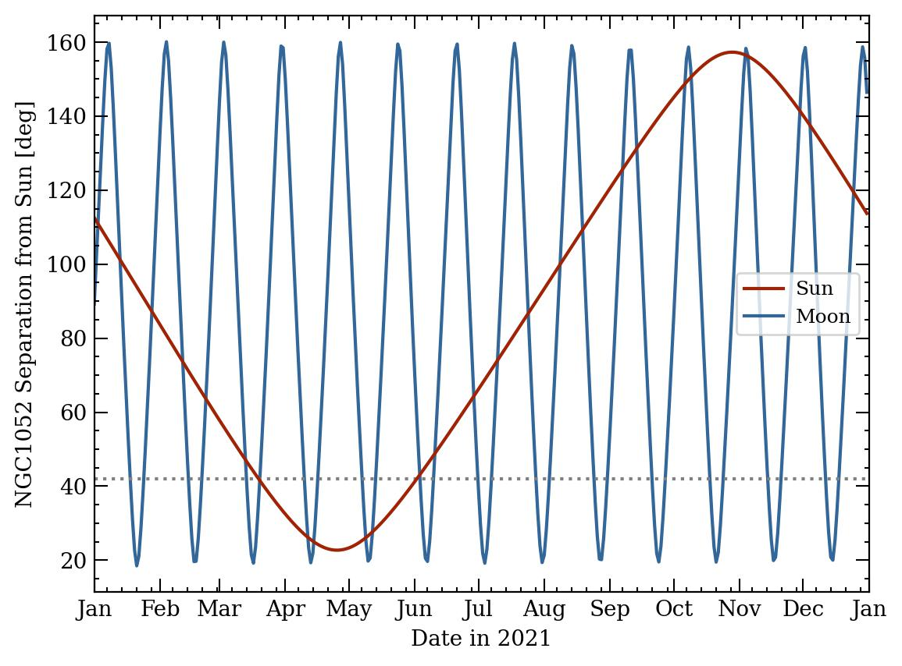
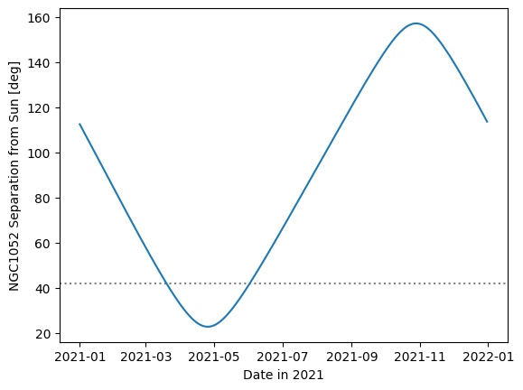
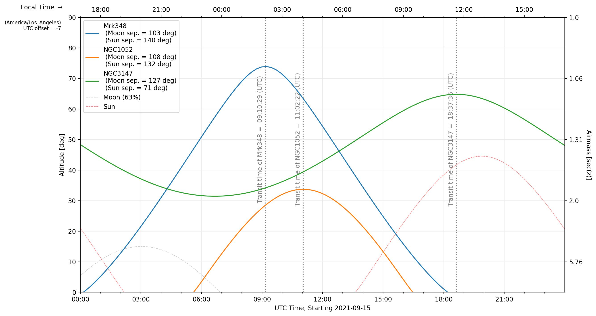

#  Preparing for some VLBA observations  

Find a good starting point for your VLBA observation parameters

This is not so much intended to replace NRAO's venerable sched software, which has some wonderful functionality.  Rather, this is intended to complement other tools and help you plan for your observing session in a python workflow.  


This example will demonstrate how to use obsplanning to do various things related to planning VLBA (and other VLBI) observations:
- Create target source objects
- Calculate optimal date to observe a target in a particular year
- Determine the optimal start times for each day within a month (or other time period)
- Plot the separation of a target from the Sun over the course of a year
- Plot visibility tracks over a defined period, for single stations and the full array
- Determine the nearest standard fringe finders
- Make some simple sensitivity calculations
- Other tools for radio data


-----------------------


### Altitude plots and optimal times

First, some setup - importing packages.

```python
import numpy as np
import matplotlib.pyplot as plt
import datetime as dt
import ephem
import obsplanning as obs

```


Create the pyephem.FixedBody objects for each of the target sources in the observations.  In this example, let's consider 3 quasars: Mrk 348, NGC 1052, and NGC 3147.  

```python
# Initiate with obs.create_ephem_target(name,RA,DEC)
Mrk348=obs.create_ephem_target('Mrk348','00:48:47.14','31:57:25.1')         #v_hel = 4507 km/s
ngc1052=obs.create_ephem_target('NGC1052','02:41:04.7985','-08:15:20.751')  #v_hel = 1510 km/s
ngc3147=obs.create_ephem_target('NGC3147','10:16:53.65','73:24:02.7')       #v_hel = 2802 km/s

```

Normally you would also create ephem.Observer objects for the antennae/stations/observatories like so:
```python
vlbaOV=ephem.Observer();
vlbaOV.name='vlbaOV'
vlbaOV.lon='241:43:22.63'; vlbaOV.lat='37:13:53.95'; vlbaOV.elevation=1196;

# Or, using the obsplanning convenience function,
vlbaOV=obs.create_ephem_observer('vlbaOV','241:43:22.63','37:13:53.95',1196)

```
But Observer() objects for the VLBA stations are already built in to obsplanning -- for this example of the Owens Valley station, obs.vlbaOV.


What time of year is optimal for observing these targets?  That can depend on a variety of things, but for the purposes here that means the target will pass high overhead (not be stuck too close to the horizon) and that it will not be too close to the Sun (small separations can be fine at higher frequencies, but can significantly impact observations at low frequencies like L-band).


First, check when the optimal day to observe is, from a visibility standpoint.  Since the VLBA is entirely in the Northern Hemisphere, far north targets are easy to observe from all stations.  However, more southerly targets may be quite close to the horizon as seen from the northernmost stations, so those will probably be the limiting factors here.  Calculate and print the optimal visibility time for NGC 1052 as seen from the Brewster station in Washington State.  
```python
obs.optimal_visibility_date(ngc1052, obs.vlbaBR, '2021', extra_info=True, verbose=True,
    return_fmt='str', timezone='America/Los_Angeles', time_of_obs='noon', peak_alt=False,
    local=True);

```
This prints out:
```python
# Optimal observing date for NGC1052, from vlbaBR, in year 2021:
#   2021/09/12  with transit occurring at 04:14:09 local time
#   On that date, rise time = 22:48:27, set time = 09:39:51, peak altitude = 33.7 deg
#   At transit, separation from Sun = 130 deg, Moon separation = 148 deg, Moon = 31% illuminated
```

That gives us a good start time, which also has a substantial separation from the Sun.  But let's plot the Sun separation over the course of the year, to see if there are any potential danger zones if we were to choose to observe at another time:
```python
# Using the built-in function for plotting Sun separations.
obs.plot_sunseps_year(ngc1052, obs.vlbaBR, 2021, min_sep_val=42., min_sep_type='deg',
    savepath='./sunseps_all_ngc1052_2021.jpg', moon=True)
```

Note that the minor ticks on the x (time) axis are 7-day increments from the start of the month.

The horizontal dashed line specified here is at 42 degrees, the minimum required separation for L-band observations.  This shows that as far as Sun separation goes, you can observe at L-band any time except for roughly March through June.

What is the minimum required separation from the Sun?  The NRAO values have been incorporated into obsplanning and can be referenced for a particular frequency in GHz:
```python
# Query at 6.5 GHz
obs.VLBA_freq_minimum_sun_separation(6.5)
#--> 19.74 (degrees minimum at C band / 6.5 GHz)

```
In ```obs.plot_sunseps_year()```, instead of directly specifying the number of degrees as in the example above, you can set ```min_sep_type='freq'``` and then give ```min_sep_val``` the observing frequency in GHz, and it will automatically calculate the minimum separation for you from that built-in table.


Here is a breakdown of how you could generate a Sun separation plot manually:
```python
# Create an array daily datetime objects for the year
times_2021year_utc = obs.create_obstime_array( dt.datetime(2021,1,1,0,0,0),  
    dt.datetime(2021,12,31,0,0,0), timezone_string='UTC', n_steps=365 )

# Now calculate the separation from the Sun for each date/time in that array
ngc1052_sunseps = obs.sunsep_timearray(ngc1052, obs.vlbaBR, times_2021year_utc)

# Finally, plot these separations over the course of the year
plt.plot(times_2021year_utc, ngc1052_sunseps)
plt.axhline(42., ls=':', color='0.5', zorder=-1)
plt.xlabel('Date in 2021'); plt.ylabel('NGC1052 Separation from Sun [deg]')
#plt.savefig('sunsep_ngc1052_2021.jpg',bbox_inches='tight')
plt.show(); plt.clf(); plt.close('all')

```



To print out the Sun separations each day in a month, there is a built-in function for printing them every N days:
```python
# Every 7 days at noon - June 1,8,15,22,29
daily_sunseps(ngc1052, obs.vlbaBR, '2021/06/01 12:00:00', '2021/06/30 12:00:00',
    every_N_days=7)
#NGC1052
#  On 2021/6/1 12:00:00, Sun separation = 41.6 deg
#  On 2021/6/8 12:00:00, Sun separation = 47.2 deg
#  On 2021/6/15 12:00:00, Sun separation = 53.0 deg
#  On 2021/6/22 12:00:00, Sun separation = 58.9 deg
#  On 2021/6/29 12:00:00, Sun separation = 64.9 deg
## np.array([41.62532825, 47.21039205, 52.99052677, 58.89973639, 64.89923576])
```

Alternatively, you could do something manually like this:
```python
junestart=ephem.Date('2021/06/01 00:00:00');
juneend=ephem.Date('2021/06/30 23:59:59');
days_june=np.linspace(junestart, juneend, int(np.round(juneend-junestart))+1 )

ngc1052_sunseps_june=obs.sunsep_timearray(ngc1052,obs.vlbaBR,days_june)
for d in range(len(days_june)):
    print('  On %s, Sun separation = %.1f deg'%(str(ephem.Date(days_june[d])),
          ngc1052_sunseps_june[d]))

#  On 2021/6/1 00:00:00, Sun separation = 41.2 deg
#  On 2021/6/2 00:00:00, Sun separation = 42.0 deg
#  On 2021/6/3 00:00:00, Sun separation = 42.8 deg
#  On 2021/6/4 00:00:00, Sun separation = 43.6 deg
# ...

#--> Passes the L-band safe mark of 42.0 deg starting June 3rd.

```


Now, let's say we have decided to observe our three targets in one observing session on September 15, 2021.  Perhaps for scheduling simultaneous X-ray observations on that particular day, or other external considerations.  If we know the total required observation time in hours (including any phase referencing, expected overhead from slewing, etc.), then the optimal start time for the VLBA array observations of a single target can be calculated easily for each day in a specified time period with obsplanning:
```python
septemberstart = ephem.Date('2021/09/01 00:00:00');
septemberend = ephem.Date('2021/09/31 23:59:59');

# Say, for example, we are aiming for a 3.2 hour K-band observation
obs.print_VLBA_observability_between_dates(ngc1052, 3.2, septemberstart, septemberend,
    obstypestring='K-band', outtimefmt='%Y/%m/%d %H:%M:%S')

# Optimal VLBA observation start times between 2021 September 01 and 2021 October 01,
# for 3.20 hr duration K-band obs. of NGC1052:
# -----------------------------------------------------------------
#   Sep 01  --  2021/09/01 09:23:25 UTC,  2021/09/01 00:53:59 LST
#   Sep 02  --  2021/09/02 09:19:29 UTC,  2021/09/02 00:53:59 LST
#   Sep 03  --  2021/09/03 09:15:33 UTC,  2021/09/03 00:53:59 LST
# ...

# This prints optimal start times for each date, in UTC and also in Pie Town LST
# for use in sched .key files.

```

Or, if you just want to return the optimal start time for one day instead of a range:
```python
obs.calculate_optimal_VLBAstarttime(ngc1052, '2021/09/15 00:00:00', 3.2,
    weights=None, mode='after')
# --> '2021/09/15 08:28:23'

for target,lab in zip([Mrk348,ngc1052,ngc3147], ['Mrk348','ngc1052','ngc3147',]):
    print('%s  --  %s'%(lab,obs.calculate_optimal_VLBAstarttime(target,
        '2021/09/15 00:00:00', 3.2, weights=None, mode='after')) )

# Mrk348  --  2021/09/15 06:36:30
# ngc1052  --  2021/09/15 08:28:23
# ngc3147  --  2021/09/15 16:03:37
```

The functions that calculate transits relative to a reference time have a keyword called "mode" - this specifies whether the transit time to return is the last transit before, the next transit after, or the nearest transit to the input time.  Note that in the examples above, mode='after' was used, because we specified a reference time of '2021/09/15 00:00:00', and we wanted to get the transit time during that day (after 00 hours).  The default transit time to calculate in obsplanning is typically mode='nearest', which could potentially be before the reference time. For example, if we queried NGC1052 in April instead of September, with mode='nearest', it correctly determines that the nearest transit is at 18:33 the previous evening :
```python
obs.calculate_optimal_VLBAstarttime(ngc1052, '2021/04/15 00:00:00', 3.2, weights=None, mode='nearest')
# --> '2021/04/14 18:33:50'
```


What if you are interested in finding reasonable start time ranges for dynamical scheduling instead of fixed time observations?  There is a function in obsplanning that will print out sensible estimates for start times (in PT LST, as required):
```python
print('\nEstimated dynamical scheduling start times in PT_LST for 2021/09/15:')
print( obs.calculate_VLBA_dynamic_starttime_range(ngc1052,
    ephem.Date('2021/09/15 00:00:00'), 3.2, weights=None,
    return_fmt='%Y/%m/%d %H:%M:%S', elevation_limit_deg=10., LST_PT=True,
    plotresults=False) )

# Estimated dynamical scheduling start times in PT_LST for 2021/09/15:
# ['2021/09/15 00:46:12', '2021/09/15 01:43:09']

# Note that the weights can be used here to emphasize or even deselect certain stations.
# The order is [BR,FD,HN,KP,LA,MK,NL,OV,PT,SC], so if you are only using the first 5 stations,
# you could use weights=[1,1,1,1,1,0,0,0,0,0] to deselect the last 5.
```

A simplified way to display a summary of the above calculations is to use ```print_VLBA_observability_summary()```.  Here is an example:
```python
ngc2992=obs.create_ephem_target('NGC2992','09:45:42.05','-14:19:34.98')

# For 4 hour duration obs at 22GHz, print every 10 days for August 2021
obs.print_VLBA_observability_summary(ngc2992, ephem.Date('2021/08/01 00:00:00'),
    ephem.Date('2021/08/31 23:59:59'), 10, ephem.Date('2021/08/15 00:00:00'),
    4.00, 22.0, weights=None)

### Output:
#Optimal VLBA observation start times between 2021 August 01 and 2021 August 31,
#for 4.00 hr duration K-band obs. of NGC2992:
#-----------------------------------------------------------------
#  Aug 01  --  2021/08/01 18:04:42 UTC,  2021/08/01 07:34:28 LST
#  Aug 11  --  2021/08/11 17:25:23 UTC,  2021/08/11 07:34:29 LST
#  Aug 21  --  2021/08/21 16:46:04 UTC,  2021/08/21 07:34:29 LST
#  Aug 31  --  2021/08/31 16:06:45 UTC,  2021/08/31 07:34:29 LST
#
#Estimated dynamical scheduling start times in PT_LST for 2021/8/15 :
#['2021/08/15 07:34:29', '2021/08/15 07:34:29']
```

--------------------------------------------------------------------------------


Now let's make a plot of the visibility of a target over the course of a day.  This is a way to graphically verify the times during which the target is up or down at each station.  Let's say that your observing strategy is to cycle through the three targets (Mrk348, NGC 1052, NGC 3147) to maximize uv coverage, and the total estimated project duration is 7.5 hours.  If this duration is supplied, the optimal start time will be noted on the plot with a dotted line.
```python
# Define a start and end time to consider for plotting visibility tracks: spanning the whole day of
# September 15, 2021
daystart = ephem.Date('2021/09/15 00:00:00');
dayend = ephem.Date('2021/09/15 23:59:59');

# Full VLBA visibility (altitude) tracks, single object at a time
# Here, assume
obs.plot_VLBA_visibility_tracks(ngc1052,daystart,dayend, dpi=90,  
    savepath='./ngc1052_fullVLBA_september15.jpg', showplot=False,
    duration_hours=7.5)

```
This plots the visibility (elevation) tracks for each VLBA station, and denotes the mean transit time among all stations.  Station weights can be supplied here for the mean transit time calculation.


We can also plot the visibility of all of our planned target sources at a single station, to verify that all are near optimal viewing times. This is similar to the classic staralt-style visibility plot.
```python
### Single station, multiple target tracks
obs.plot_visibility_tracks([Mrk348,ngc1052,ngc3147], obs.vlbaBR, daystart, dayend,
    plotmeantransit=False, timezone='auto', savepath='all_vlBR_september15.jpg')
```
The first two targets transit closely in time (which we could have determined from their RA coordinates), and NGC 3147 is circumpolar and visible all day.  This set of targets is good for joint observations.  


```python
obs.is_target_always_up(ngc3147,obs.vlbaBR,daystart)
#--> True
```


Do you need to determine a good fringe finder?  Obsplanning has a function to calculate the angular separations from a handful of the standard fringe finders and return the nearest one:
```python
nearestff_ngc1052 = obs.nearest_standard_fringefinder(ngc1052, verbose=True)

# Angular separations on sky from NGC1052:
#         3C84 = 50.55 deg
#        DA193 = 65.75 deg
#      4C39.25 = 104.09 deg
#        3C273 = 146.57 deg
#        3C345 = 138.34 deg
#     1921-293 = 102.23 deg
#      3C454.3 = 61.26 deg
#     0234+285 = 37.06 deg
#     0528+134 = 47.45 deg
#   J1800+3848 = 125.97 deg
#     2007+777 = 99.93 deg
# Nearest = 0234+285


### You can always calculate the angular separation between any sky targets you want like so:
SRC_3C84 = obs.create_ephem_target('3C84','03:19:48.1600956','41:30:42.104043')
print( obs.skysep_fixed_single(ngc1052,SRC_3C84) )
#--> 50.551056031843494  [degrees]

### And you can specify the ephem object itself or the separations list with the keyword
#   return_format='source' or return_format='separations', like so:
nearestff_ngc1052 = obs.nearest_standard_fringefinder(ngc1052, return_format='source')
ff_seps_ngc1052 = obs.nearest_standard_fringefinder(ngc1052, return_format='separations')
```

If you want to determine the nearest fringe finder to a _group_ of science targets, simply input the group as a list:
```python
obs.nearest_standard_fringefinder([Mrk348,ngc1052,ngc3147,ngc2992], verbose=True, stat='median')
median angular separations on sky from ['Mrk348', 'NGC1052', 'NGC3147', 'NGC2992'] (deg):
#        3C84 = 52.47 deg
#       DA193 = 63.24 deg
#     4C39.25 = 74.24 deg
#       3C273 = 109.89 deg
#       3C345 = 100.05 deg
#    1921-293 = 113.49 deg
#     3C454.3 = 75.75 deg
#    0234+285 = 53.08 deg
#    0528+134 = 67.71 deg
#  J1800+3848 = 101.94 deg
#    2007+777 = 77.38 deg
#Nearest = 3C84

##--> 0234+285 is still a good option, but 3C84 is the nearest to the members of
# this group on average (the median separation from the group is lowest for 3C84)
```


Under the hood, ```nearest_standard_fringefinder``` is just a convenience function to call ```nearest_from_target_list``` on the standard fringefinder list.  You could instead call this function to choose the nearest from among a custom list, such as this pared down selection of the built-in fringe finders (or other ephem objects):
```python
obs.nearest_from_target_list( ngc1052, [obs.SRC_DA193,obs.SRC_3C286,obs.SRC_3C273,],
    verbose=True )
#Angular separations on sky from NGC1052:
#       DA193 = 65.75 deg
#       3C286 = 152.38 deg
#       3C273 = 146.57 deg
#Nearest = DA193
```


-----------------------


### Sensitivity calculations and other radio tools

Some basic sensitivity calculation functions are available. As an example:

Say we want to observe a quasar with the VLBA at 5.0 GHz, in dual polarization. (The VLBA SEFD at C-band is 210 Jy.)  We can achieve 512MHz bandwidth per polarization.  How long do we need to integrate to get down to 25 microJy/beam rms? Here  I'm using eta=0.8 and assuming the full array will be utilized.  Using the normal radio interferometer homogeneous array sensitivity equation, this works out to about 0.33 hours.  This can be computed easily with obsplanning:
```python
# t_int = (210/(np.sqrt(2)*25e-6*0.8))**2 / (10*(10-1)*512e6)  
#       = 1196sec, or 0.33 hrs or 20 min

# obs.theoretical_VLBA_image_integration_time(freq_GHz, BW_total_GHz, Sensitivity_uJybm,
#   eta=0.8, Nstations=10, pol='dual', return_fmt='hours')
obs.theoretical_VLBA_image_integration_time(5.0, 0.512, 25.0, eta=0.8,
    Nstations=10, pol='dual', return_fmt='hours')
#--> 0.3323025173611111 [hours]

# Alternatively, for a general homogeneous VLBI array:
obs.theoretical_vlbi_integration_time_homogeneous(25e-6, 210, 0.8, 10, 512e6, pol='dual')
#--> 1196.29 [seconds, equals 0.33 hours]
```


Going the other direction, calculate the image sensitivity theoretically achievable in 1.0 hours of integration time:
```python
# obs.theoretical_VLBA_image_sensitivity(freq_GHz, BW_total_GHz, t_int_hr, eta=0.8,
# Nstations=10, pol='dual')
obs.theoretical_VLBA_image_sensitivity(5.0, 0.512, 1.0, eta=0.8, Nstations=10, pol='dual')
# --> 1.4411421628371519e-05  [Jy/beam] or 14.41 microJy/beam

```

Return the VLBA sensitivity table info for a particular frequency in GHz:
```python
obs.get_VLBA_sensitivity_table_info(5.)
#Returns --> ['6 cm', 210, 0.119, 2.1, 5]
#[receiver_name, zenith_SEFD(Jy), peak_gain(K/Jy), baseline_sensitivity(60min),
# image_sensitivity(8hrs)]

```


This function will print out the common name of the band a particular frequency (in GHz) falls within:
```python
obs.band_from_freq(7.3, print_table=True)  
#-->  'C'

# Band Name   Frequency Range (GHz)   Wavelength Range (cm)
# ------------------------------------------------------------
#     4            0.054 - 0.084         356.05 - 555.17
#     P            0.200 - 0.503          59.60 - 149.90
#     L            1.000 - 2.040          14.70 - 29.98  
#     S            2.000 - 4.000           7.49 - 14.99  
#     C            4.000 - 8.000           3.75 - 7.49   
#     X            8.000 - 12.000          2.50 - 3.75   
#     Ku          12.000 - 18.000          1.67 - 2.50   
#     K           18.000 - 26.500          1.13 - 1.67   
#     Ka          26.500 - 40.000          0.75 - 1.13   
#     Q           40.000 - 50.000          0.60 - 0.75

```


If you would like to print information from the header of an .idifits file without first loading it into CASA (e.g., useful for checking what each file in a folder contains), use this convenience function like so:
```python
# Example usages:
obs.info_from_idifits('myVLBAquasar_Kband.idifits',print_style='long');
obs.info_from_idifits('/home/observerdude/data/NGC3079_Kband.idifits',print_style='short');

for f in sorted(glob('/some/directory/with/idifits/')):
    obs.info_from_idifits(f,print_style='short');  
#Note the semicolon at the end, to suppress the return output in ipython...
```


-----------------------


### Optimal order for slewing between sources

Let's look at an example of observing a handful of bright galaxies at a similar RA as Andromeda.  Let's use the automatic coordinate query function for this example, and use dec2sex to explicitly to format the coordinate output.
```python
gal_list = ['m1', 'm31', 'm33', 'm74', 'm77', 'ngc1275']
gal_targets = [obs.create_ephem_target(n,*obs.query_object_coords_simbad(n))
                 for n in gal_list]

for t in gal_targets:
  print('  %4s : [ %s, %s]'%(t.name,
     *obs.eph2c(t, as_string=True, decimal_places=4) ) )
#    m1 : [ 05:34:30.9000, 22:00:53.0000]
#   m31 : [ 00:42:44.3300, 41:16:07.5000]
#   m33 : [ 01:33:50.8965, 30:39:36.6300]
#   m74 : [ 01:36:41.7451, 15:47:01.1070]
#   m77 : [ 02:42:40.7091, -00:00:47.8590]
#  ngc1275 : [ 03:19:48.1599, 41:30:42.1080]


##Note that we could also just use  
#  print('  %4s : [ %s, %s]'%(t.name, t.a_ra, t.a_dec)
#However using eph2c or dec2sex to create the string representations from the
# stored ephem coords (in radians) allows more customization.
```

Quickly calculate the min and max source separations.
```python
import itertools
seps = [obs.skysep_fixed_single(*pair) for pair in
    itertools.combinations(gal_targets, 2)]
print('Separations:\n  min = %.1f\n  max = %.1f'%(np.min(seps), np.max(seps)) )
#Separations:
#  min = 14.8
#  max = 63.1

#--> The source separations range from 15 to 63 degrees on the sky.

## Equivalently,
#seps = np.array([ephem.separation(*pair) for pair in
#    itertools.combinations(gal_targets, 2)]) * 180/np.pi
```

In this particular case, let's assume that we want to observe each target for a few scans, then slew to the next one and so on, and eventually loop back around and repeat the process again.  (Rather than doing complete integrations of an hour or more on one source before moving to the next.)  For an equivalent total integration time, this will allow us to build up better uv coverage, as the Earth rotates over the course of the observing session.  

Again, note that while this function will be almost instantaneous for lists of ~7 or fewer sources, it will be extremely slow for about groups of more than about 8.  This is due to using itertools.permutations under the hood; optimization with a better algorithm for large N is a planned future update.  

Using the nominal slew speeds of 90 deg/min in the AZ axis and 30 deg/min in the EL axis, calculate the optimal slew ordering:  
```python
obs.calc_optimal_slew_loop(gal_targets, verbose=True, sortloops=True,
    optimize_by='time', AZ_deg_min=90., EL_deg_min=30.)

#Permutations (repeating the loop)
#  ['m1', 'm77', 'm74', 'm33', 'm31', 'ngc1275']: 3.08 min.  (163.1 deg)
#  ['m1', 'm31', 'ngc1275', 'm33', 'm74', 'm77']: 3.08 min.  (201.1 deg)
# ...
#  ['m1', 'ngc1275', 'm77', 'm31', 'm74', 'm33']: 5.32 min.  (223.0 deg)
```
Digging into the list a bit, the loops range from a total of 163.1 to 261.4 degrees of slewing, or a difference of ~98 degrees. But due to the elevation axis having a slower slew rate, the optimal order is a bit different than if both axes moved at the same speed.  The difference between the most and least optimal orderings is 2min 15sec -- not much time.  However, if you plan to observe these sources in say five loops to build uv coverage, optimizing the slew order can save you over 11 minutes.  That could help keep your key file schedule within your awarded time if overhead is high from phase referencing, or it could be used as extra on-source integration or extra calibrator scans.
