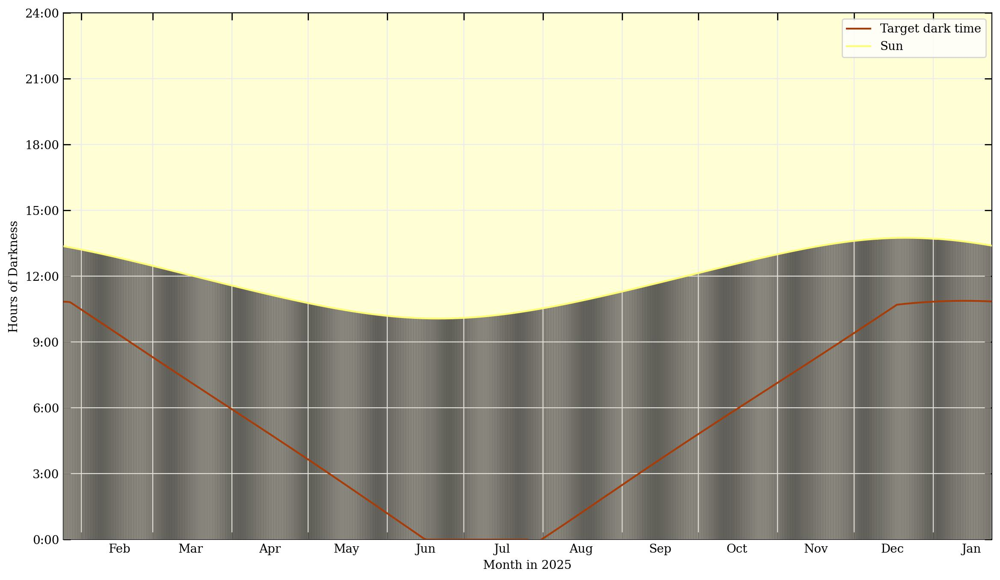
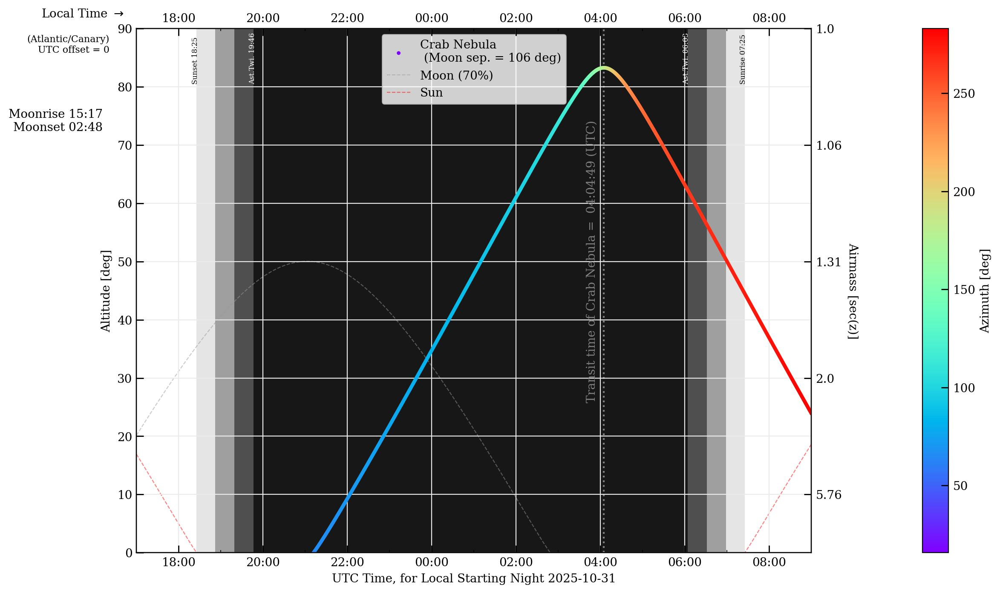
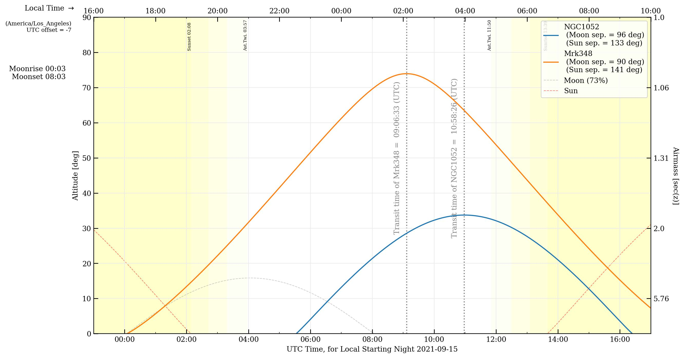
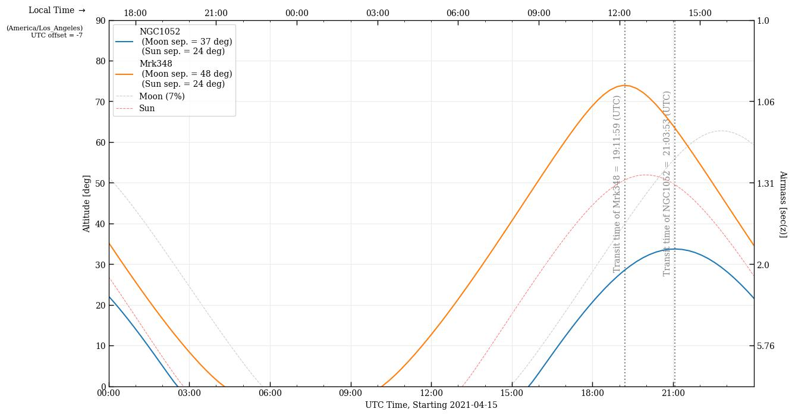

# Classic observation planning plots

Prepare classic target elevation track plots and finder plots to aid your observations.

In this example, we will plan a set of observations of the Crab Nebula from the William Herschel Telescope on lovely La Palma.  Be sure to enjoy some arepas and barraquitos while you're there.

This tutorial will also use some other galaxies for targets, and VLBA stations for additional examples.

-----------------------

## Making the observation preparation plots


```python
import numpy as np
import ephem
import datetime as dt
from astropy.time import Time
import pytz
import matplotlib.pyplot as plt

import obsplanning as obs


wht = obs.create_ephem_observer('WHT', '-17 52 53.8', '28 45 37.7', 2344)
crab = obs.create_ephem_target('Crab Nebula','05:34:31.94','22:00:52.2') 

# Observation start/end times:  5 PM to 9 AM local time
sunset, twi_civil, twi_naut, twi_astro = obs.calculate_twilight_times(wht, '2025/01/01 23:59:00')
obsstart_local_dt = obs.dt_naive_to_dt_aware( ephem.Date('2025/10/31 17:00:00').datetime(), 'Atlantic/Canary') 
obsend_local_dt   = obs.dt_naive_to_dt_aware( ephem.Date('2025/11/01 09:00:00').datetime(), 'Atlantic/Canary') 
obsstart = obs.dtaware_to_ephem(obsstart_local_dt)
obsend   = obs.dtaware_to_ephem(obsend_local_dt)


# A couple more example targets
ngc1052=obs.create_ephem_target('NGC1052','02:41:04.7985','-08:15:20.751') 
ngc3147=obs.create_ephem_target('NGC3147','10:16:53.65','73:24:02.7') 
```

Note that for subsequent calculations and plots that use local time, things will run faster if you specify the Observer's timezone beforehand (when you create it).  If you don't have the timezone name string already, it can be determined automatically.
```python
# If the timezone name is known already:
wht = obs.create_ephem_observer('WHT', '-17 52 53.8', '28 45 37.7', 2344, timezone='Atlantic/Canary')

# To automatically determine the timezone: 
wht = obs.create_ephem_observer('WHT', '-17 52 53.8', '28 45 37.7', 2344, timezone='auto')

print(wht.timezone)
# --> 'Atlantic/Canary'
```


Calculate the daily transit times, rise times, set times, and peak altitudes for the specified year.  This function is one of several that can automatically determine the timezone from the observer object (using tzwhere). 
```python
TRSP = obs.compute_yearly_target_data(crab, wht, '2025', timezone='auto', time_of_obs='night', \
        peak_alt=True, local=True)
# --> Four arrays: Transit,Rise,Set,PeakAltitude for each of the 365 days in the year
```

Calculate the previous set+rise times and next set+rise times for NGC1052, as seen from the St Croix VLBA station
```python
prev_setrise,next_setrise = obs.calculate_antenna_visibility_limits(ngc1052, obs.vlbaSC, 
        ephem.Date('2025/01/01 20:36:31'), elevation_limit_deg=15.)
```


Now plot the Rise/Set/Transit times over the course of the calendar year.  This is a somewhat busy plot, but compactly visualizes how the daily rise, set, and transit times vary over the course of the year. Daytime is also denoted by light yellow shading.
```python
obs.plot_year_RST(crab, wht, '2025', showplot=True, savepath='./crab_2021RST.jpg')
```
The 1-hour discontinuities in March and October are due to the daylight savings time switches. 


Calculate the optimal day/time to observe a specified target from a specified observer site, for the given year.  This is based on the highest peak altitude.
```python
obs.optimal_visibility_date(crab,wht,'2025',time_of_obs='night', verbose=True, local=True, extra_info=False)
# --> '2025/01/24 22:29:36'

### With verbose=True, info also printed to screen:
# Optimal observing date for Crab Nebula, from WHT, in year 2025:
#   2025/01/24  with transit occurring at 22:29:36 local time
#   On that date, rise time = 15:36:35, set time = 05:22:38, peak altitude = 83.3 deg
#   At transit, separation from Sun = 139 deg, Moon separation = 163 deg, Moon = 22% illuminated
```
This will run much faster if you supply the timezone (or it's already set for the observer in 'auto' mode), rather than auto-calculating it from the observer location. (In the case of wht above: timezone='Atlantic/Canary')  Users can specify the time of day to consider for calculating the optimal date, using the time\_of\_obs keyword - either with one of the accepted string descriptors ('midnight', 'noon', 'middark', 'peak'), or any specific time of the day formatted as 'HH:MM:SS', for example '23:00:00' for 11 PM.


Plot the observability of the target over the course of the year, with peak altitudes of the target and separations from the Sun & Moon denoted.   Next, plot the dark time over the course of a year, from the specified observing site, and plot the target altitude track. These plots are similar to the components of the classic 'starobs' plot.
```python
obs.plot_year_observability(crab, wht, '2025', time_of_obs='22:00:00', \
    savepath='./crab_observability_2025.jpg') #Specifying calculations at 10PM

obs.plot_year_darktime(crab, wht, '2025', savepath='./crab_darktime_2025.jpg')
```




In the darktime plot, date is on the x-axis, and the number of hours of nighttime is the value plotted on the y-axis.  The yellow shading represents daylight, and the dark shading in the lower part is nighttime.  The vertical bands of lightness during the nighttime represent the brightness of the moon, from new (darker gray) to full moon (lighter white).


### Visibility tracks

Now, when a particular night has been selected for observations, it's very useful to plot the target's altitude (or multiple targets' altitudes), in order to time scans as close to transit as possible.  This following function plots visibility tracks of an astronomical target on the sky, over the course of a night - like a classic 'staralt' plot. 
```python

obs.plot_night_observing_tracks(crab,wht,obsstart,obsend, simpletracks=False, toptime='local', \
    timezone='calculate', n_steps=1000, azcmap='rainbow', savepath='crab_visibility_tracks.jpg')
```


Besides the target elevation track and the transit time, useful information such as moonrise/moonset and moon illumination is included, and the Sun and Moon tracks are also shown for reference.  The target's angular sky separation from the Sun and Moon are given in the legend.  Night time is shaded as black (and the various grades of twilight in lighter grays), with twilight and sunset/sunrise denoted by vertical labels near the top of the plot.  UTC time is shown on the bottom axis, with the equivalent local time on the top. (In this example they are the same, because the WHT has a UTC offset of 0 hours.)


In the plot above, the target's azimuth with respect to the observatory is color coded by the cmap on the right, and this may help with considerations of things such as cable wraps.  However, it may be preferable to use the simple_tracks=True option to plot lines as simple solid colors instead of the azimuth-colormapped track line, especially if multiple target tracks are plotted.  
```python
obs.plot_night_observing_tracks([crab,ngc1052], wht, ephem.Date('2025/01/03 17:00:00'), ephem.Date('2025/01/04 09:00:00'), simpletracks=True, toptime='local', timezone='calculate', n_steps=1000, savepath='crab_visibility_tracks2.jpg')
```


This function is actually just a convenience function for calling obs.plot_observing_tracks() with the default option for a dark nighttime background color (light_fill=False).  There is an option for a light-color background fill, which may be more suitable for daytime or other observations that are not dark-limited.  The daytime is now represented by color shading and the nighttime has no fill. Here is an example of observing a couple different targets from a telescope observing during the daytime.
```python
ngc1052=obs.create_ephem_target('NGC1052','02:41:04.7985','-08:15:20.751') 
mrk348=obs.create_ephem_target('Mrk348','00:48:47.14','+31:57:25.1') 


obsstart2=obs.dtaware_to_ephem(obs.construct_datetime('2021/09/15 16:00:00','dt',timezone='US/Pacific')) 
obsend2=obs.dtaware_to_ephem(obs.construct_datetime('2021/09/16 10:00:00','dt',timezone='US/Pacific')) 

obs.plot_day_observing_tracks([ngc1052,mrk348],obs.vlbaBR,obsstart2,obsend2, plotmeantransit=False, \
        simpletracks=True, toptime='local', timezone='US/Pacific', n_steps=1000, azcmap='rainbow', \
        savepath='Brewster_visibility_tracks.jpg', showplot=False)
#or, equivalently, 
# obs.plot_observing_tracks( ... , light_fill=True )
```



More examples of elevation track plots and calculations oriented towards VLBI can be found in later sections. 


To give more flexibility (for modifying the plot for your purposes, annotating, etc), it's possible to plot the altitude tracks to a figure axis.  These visibility traacks could then be included in more complex plots, with user-defined axes or sublots, etc.
```python
fig1=plt.figure(1,figsize=(14,8)) 
ax1=fig1.add_subplot(111) 
obs.plot_visibility_tracks_toaxis([ngc1052,mrk348],obs.vlbaBR, ephem.Date('2021/04/15 00:00:00'), \
    ephem.Date('2021/04/15 23:59:59'), ax1, timezone='US/Pacific') 
plt.savefig('ngc1052_fullVLBA_april15.jpg'); plt.clf(); plt.close('all')


# The above plotting and saving out can also be accomplished with this convenience function:

obs.plot_visibility_tracks(target_list,observer,obsstart,obsend, weights=None, duration_hours=0, \ 
    plotmeantransit=False, timezone='calculate', xaxisformatter=mdates.DateFormatter('%H:%M'), \
    figsize=(14,8), dpi=200, savepath='ngc1052_fullVLBA_april15.jpg',showplot=False)
```



### Finder plots


To make a finder plot to help identify a starfield around a target, you will need a background image.  In particular, if you want to be able to use WCS axes for coordinates, or to mark reference stars, .fits files will be the best format.  You can use your own .fits image, but obsplanning includes a tool to automatically download cutout images in .fits format from a variety of surveys.  Specify either a set of target coordinates or a common resolver name (e.g., 'M31'), and an image width, and a survey name, and astroquery will retrieve your image.  Here are examples, using different methods of input:
```python
#Download single cutout

obs.download_cutout([83.63725, 22.0145], 10.,'Crab_2massJ_10arcmin.fits', survey='2MASS-J', \ 
    boxwidth_units='arcmin') #Crab Nebula, M1 

bs.download_cutout(obs.sex2dec('05:34:32.94','22:00:52.2'), 10.,'Crab_2massJ_10arcmin.fits', \
    survey='2MASS-J', boxwidth_units='arcmin') 

obs.download_cutout('NGC1275', 90., './NGC1275_SDSSr_90asec.fits', survey='SDSSr', search_name=True, \ 
    boxwidth_units='asec')
```

There is also a function to download cutouts from several surveys at once for a particular target:
```python
obs.download_cutouts('M104',90.,'./M104_90asec', surveybands=['DSS2 Blue','DSS2 Red','DSS2 IR'], \ 
    search_name=True, boxwidth_units='arcsec')
```

Some convenience functions for a few named surveys:
```python
obs.download_sdss_cutouts('M104',90.,'./M104_90asec',search_name=True, boxwidth_units='arcsec', \ 
    SDSSbands=['SDSSg','SDSSi','SDSSr'])
obs.download_dss_cutouts('M104',90.,'./M104_90asec',search_name=True, boxwidth_units='arcsec')
obs.download_galex_cutouts('M104',90.,'./M104_90asec',search_name=True, boxwidth_units='arcsec')
obs.download_wise_cutouts('M104',90.,'./M104_90asec',search_name=True, boxwidth_units='arcsec')
obs.download_2mass_cutouts('M104',90.,'./M104_90asec',search_name=True, boxwidth_units='arcsec')
obs.download_ukidss_cutouts('M104',90.,'./M104_90asec',search_name=True, boxwidth_units='arcsec')
```


Making the finder plots is easy with obsplanning.  There are several options, depending on how you would like to display the background sky image: as a single image using a colormap, as an RGB image of 3 separate frames, or as a multicolor image for an arbitrary number of individually colorized image frames.

First, a single band background with colormap.  Let's make a finder plot for the Crab Nebula, and also mark a couple reference stars.
```python
# For the reference stars, the input format will be [RA,DEC,label]
refstars=[['5:34:42.3','22:10:34.5','HD 244988'], ['5:34:36.6','21:37:19.9','HD 36707'],]

# Now create the the finder plot with a single command:
obs.make_finder_plot_singleband('Crab Nebula', 'M1', 50., boxwidth_units='arcmin', \
    survey='DSS2 Red', search_name=True, refregs=refstars, cmap='gist_yarg', dpi=200, \
    tickcolor='0.2', mfc='r', mec='w', bs_amin=10., )
```


Now use three different bands to create a simple RGB combination image as the background.  Aside from looking nicer, this can help bring out the color in the field stars, etc.
```python
refstars=[['5:34:42.3','22:10:34.5','HD 244988'], ['5:34:36.6','21:37:19.9','HD 36707'],]

obs.make_finder_plot_simpleRGB('M1', obs.sex2dec('05:34:31.94','22:00:52.2'), 50., \
    'DSS2 IR','DSS2 Red','DSS2 Blue', boxwidth_units='arcmin', refregs=refstars, \
    Rscalefunc='linear', Gscalefunc='linear', Bscalefunc='linear', dpi=200, tickcolor='0.8', \ 
    mfc='#C11B17',mec='w',bs_amin=10., filetype='jpg')
```


Now finally, you can use any number of different bands, and colorize them to any desired color, to create a custom multicolor background image.  This may be particularly useful if you only have access to 2 images, in which case a simple RGB (missing one) would look off.
```python
refstars=[['5:34:42.3','22:10:34.5','HD 244988'], ['5:34:36.6','21:37:19.9','HD 36707'],]

obs.make_finder_plot_multicolor('M1', obs.sex2dec('05:34:31.94','22:00:52.2'), 50., \
    [['DSS2 Red','#A83C09'], ['DSS2 Blue','#336699']], boxwidth_units='arcmin', \
    refregs=refstars, scalefuncs=['linear','linear'], dpi=200, tickcolor='0.8', \
    mfc='#C11B17', mec='w',bs_amin=10., filetype='jpg')
```


